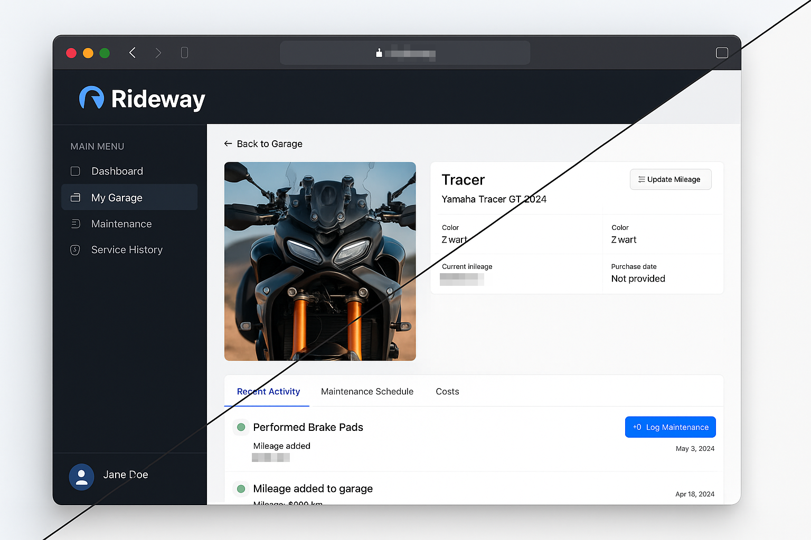
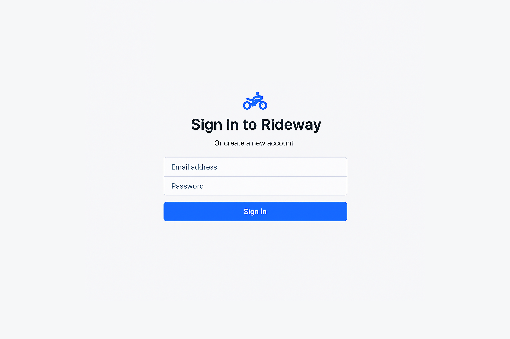

<h1 align="center">Rideway</h1>

<h4 align="center">🏍️ Keep your bikes running smooth 🏍️</h4>

> NOTE: This project was 100% vibe coded. It was built to meet our own needs for a feature-rich, user-friendly open source motorcycle maintenance app. It's still **work in progress**. Feel free to collaborate to bring the first version live.



Hey fellow riders! Rideway is your digital garage buddy that helps you stay on top of maintenance for all your motorcycles. Whether you're wrenching on a vintage café racer or maintaining a fleet of modern sport bikes, Rideway's got your back.

<h4 align="center"><a href="#screenshots">SCREENSHOTS</a> | <a href="#">DEMO</a></h4>

## Why Rideway?

Ever forgot when you last changed your oil? Lost track of maintenance receipts? Wondered if those fork seals are due for service? Rideway solves all that with:

- **🔧 Maintenance Tracking** - Set it once, and get reminded based on miles or time
- **📝 Complete Service History** - Every oil change, valve adjustment, and tire swap in one place
- **💰 Cost Management** - Know exactly what you're spending on each bike
- **📊 Visual Dashboard** - See what's due at a glance with color-coded priorities
- **💾 Data Backup** - Export everything as JSON and never lose your records
- **📱 Mobile Friendly** - Check your maintenance schedule from the garage or on the road

## Built for Riders, by Riders

We use modern web tech that just works:
- Next.js 15 with TypeScript for speed and reliability
- SQLite database - your data stays on your machine
- Clean, responsive design with Tailwind CSS
- Secure authentication to keep your garage private
- Charts and graphs to visualize your maintenance costs

## Deployment

### Heroku one-click deploy

Deploying Rideway to Heroku is a breeze. It's as simple as clicking this button:

[](https://heroku.com/deploy?template=https://github.com/melosso/rideway/tree/master)

Follow the documentation to understand setting the correct environment variables for the app to work with all the features. There might be breakages if you do not set the relevant environment variables.

### Other deployment options

For now, you'll have to rely on using your own skills to set-up a server with the following commands. We're working on a Docker container. 

1. **Clone the repo**
   ```bash
   git clone [repository-url]
   cd rideway
   ```

2. **Install dependencies**
   ```bash
   npm install
   ```

3. **Set up your database**
   ```bash
   npm run db:setup
   npm run db:migrate
   ```

4. **Fire it up**
   ```bash
   npm run dev
   ```

5. **Open your browser**
   Visit [http://localhost:3000](http://localhost:3000)

The setup wizard will walk you through creating your account and adding your first bike.

## Features That Matter

### For Weekend Warriors
- Get maintenance reminders before that big ride
- Track multiple bikes with different service schedules  
- Store photos of your bikes and maintenance work
- Quick mileage updates after each ride

### For DIY Mechanics
- Create custom maintenance schedules for modified bikes
- Keep detailed notes on parts used and procedures followed
- Track costs to budget for future maintenance
- Store digital copies of receipts and invoices

### For Multi-Bike Owners
- Manage your entire fleet from one dashboard
- Compare maintenance costs across different bikes
- Export/import data to share between devices
- Set priority levels for urgent maintenance tasks

## Your Data, Your Control

- All data stored locally in SQLite
- Export your complete garage anytime as JSON
- Import your data on any device running Rideway
- No cloud subscriptions or vendor lock-in

## User Management & Password Reset

In Rideway, you can reset a password through the `Settings` page. If a user has lost their password, a CLI-based admin tool is available for managing user accounts without requiring external integrations. Perfect for self-hosted environments!

### Password Reset Process

#### Generate a reset token for a user
```bash
# Using Node.js directly
node app/scripts/reset-password.js generate john@example.com

# In Docker environment
docker-compose exec app node app/scripts/reset-password.js generate john@example.com
```

This will generate a password reset token and provide:
- A URL that can be shared with the user (they can reset their password through the web interface)
- Instructions for resetting via command line

You can share the URL you've received from the CLI with whomever has lost their password:

```
https://your-website.com/auth/reset-password/<token-here>
```

#### Reset a password directly via command line
```bash
# Using Node.js directly
node app/scripts/reset-password.js reset <TOKEN> "new-secure-password"

# In Docker environment
docker-compose exec app node app/scripts/reset-password.js reset <TOKEN> "new-secure-password"
```


Each token:
- Is unique and cryptographically secure
- Expires after 24 hours
- Can only be used once

## Screenshots

<h5 align="center">Login</h5>


## Contributing

Got ideas? Found a bug? PRs are welcome! This is open source software built by riders for riders.

## Support

- Create an issue for bug reports
- Start a discussion for feature requests
- Check the wiki for common questions

## License

MIT License - Use it, modify it, share it!

---

*Keep the rubber side down! 🏍️*
