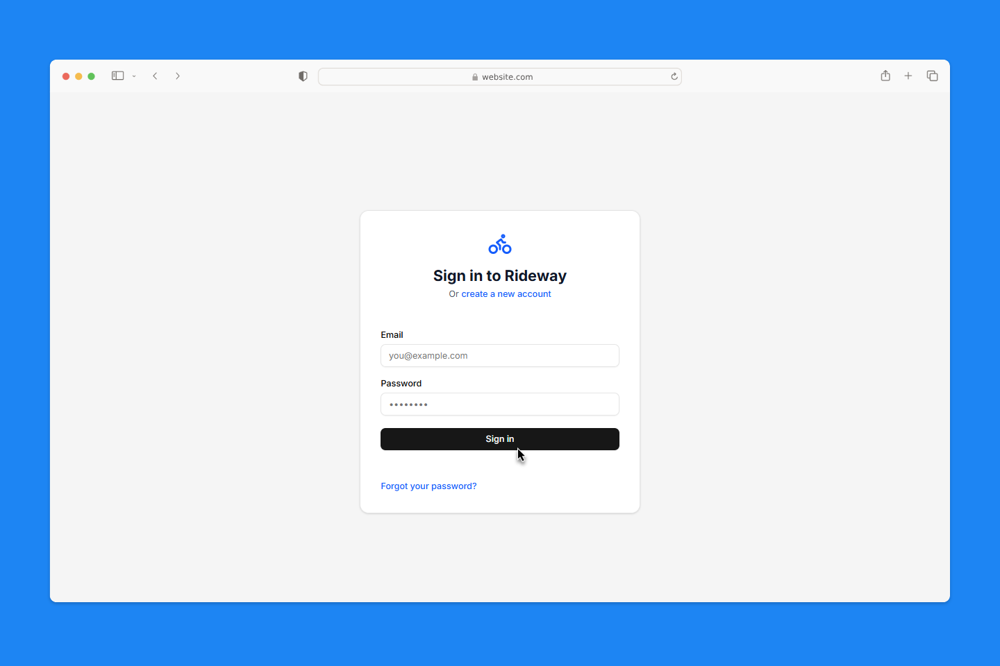

<h1 align="center">Rideway</h1>

<h4 align="center">🏍️ Keep your bikes running smooth 🏍️</h4>

> NOTE: This project was 100% vibe coded. It was built to meet our own needs for a feature-rich, user-friendly open source motorcycle maintenance app. It's still **work in progress**. Feel free to collaborate to bring the first version live.

Hey fellow riders! Rideway is your digital garage buddy that helps you stay on top of maintenance for all your motorcycles. Whether you're wrenching on a vintage café racer or maintaining a fleet of modern sport bikes, Rideway's got your back.


<h4 align="center"><a href="#screenshots">SCREENSHOTS</a> | <a href="#">DEMO</a></h4>

## Why Rideway?

Ever forgot when you last changed your oil? Lost track of maintenance receipts? Wondered if those fork seals are due for service? Rideway solves all that with:

- **🔧 Maintenance Tracking** - Set it once, and get reminded based on miles or time
- **📝 Complete Service History** - Every oil change, valve adjustment, and tire swap in one place
- **💰 Cost Management** - Know exactly what you're spending on each bike
- **📊 Visual Dashboard** - See what's due at a glance with color-coded priorities
- **💾 Data Backup** - Export everything as JSON and never lose your records
- **📱 Mobile Friendly** - Check your maintenance schedule from the garage or on the road

## Built for Riders, by Riders

We use modern web tech that just works:
- Next.js 15 with TypeScript for speed and reliability
- SQLite database - your data stays on your machine
- Clean, responsive design with Tailwind CSS
- Secure authentication to keep your garage private
- Charts and graphs to visualize your maintenance costs

## Deployment

Rideway is built to be easy to deploy with minimal setup. Choose your preferred method:

### Option 1: Docker (Recommended)

The simplest way to run Rideway is with Docker:

```bash
docker run -d \
  -p 3000:3000 \
  -v rideway-data:/app/data \
  -v rideway-uploads:/app/public/uploads \
  -e NEXTAUTH_URL=http://localhost:3000 \
  -e NEXTAUTH_SECRET=your-secret-key-change-me-in-production \
  --name rideway \
  ghcr.io/melosso/rideway:latest
```

Then open your browser to [http://localhost:3000](http://localhost:3000)

### Option 2: Docker Compose

For more control and easier setup, use Docker Compose:

1. Create a `docker-compose.yml` file:

```yaml
services:
  rideway-app:
    image: ghcr.io/melosso/rideway:latest
    ports:
      - "3000:3000"
    volumes:
      - rideway-data:/app/data
      - rideway-uploads:/app/public/uploads 
    environment:
      - NODE_ENV=production
      - NEXTAUTH_URL=http://localhost:3000
      - NEXTAUTH_SECRET=your-secret-key-change-me-in-production
    restart: unless-stopped

volumes:
  rideway-data:
  rideway-uploads:
```

2. Start the container:

```bash
docker compose up -d
```

3. Open your browser to [http://localhost:3000](http://localhost:3000)

### Option 3: Heroku

[](https://heroku.com/deploy?template=https://github.com/melosso/rideway/tree/master)

### Environment Variables

Customize your Rideway instance with these environment variables:

| Variable | Description | Default |
|----------|-------------|---------|
| `NEXTAUTH_URL` | Your site URL | `http://localhost:3000` |
| `NEXTAUTH_SECRET` | Secret key for sessions | *Required* |
| `DEFAULT_UNITS` | Default units (metric/imperial) | `metric` |
| `DEFAULT_LANGUAGE` | Default language | `en` |
| `DEFAULT_THEME` | Default theme (light/dark) | `light` |
| `DEFAULT_CURRENCY` | Default currency code | `EUR` |

## User Management & Password Reset

If a user has lost their password, you can use the built-in admin tool to reset it:

```bash
# For Docker:
docker exec rideway node -r esbuild-register app/scripts/reset-password.js generate john@example.com

# For Docker Compose:
docker compose exec rideway-app node -r esbuild-register app/scripts/reset-password.js generate john@example.com
```

This will generate a reset URL you can share with the user:
```
https://your-website.com/auth/reset-password/<token-here>
```

You can also reset the password directly via command line:
```bash
docker exec rideway node -r esbuild-register app/scripts/reset-password.js reset <TOKEN> "new-secure-password"
```

## Features That Matter

### For Weekend Warriors
- Get maintenance reminders before that big ride
- Track multiple bikes with different service schedules  
- Store photos of your bikes and maintenance work
- Quick mileage updates after each ride

### For DIY Mechanics
- Create custom maintenance schedules for modified bikes
- Keep detailed notes on parts used and procedures followed
- Track costs to budget for future maintenance
- Store digital copies of receipts and invoices

### For Multi-Bike Owners
- Manage your entire fleet from one dashboard
- Compare maintenance costs across different bikes
- Export/import data to share between devices
- Set priority levels for urgent maintenance tasks

## Your Data, Your Control

- All data stored locally in SQLite
- Export your complete garage anytime as JSON
- Import your data on any device running Rideway
- No cloud subscriptions or vendor lock-in

## Screenshots

<h5 align="center">Login</h5>


<h5 align="center">Adding to your garage</h5>


<h5 align="center">First set-up</h5>


<h5 align="center">Dashboard</h5>


## Contributing

Got ideas? Found a bug? PRs are welcome! This is open source software built by riders for riders.

## Support

- Create an issue for bug reports
- Start a discussion for feature requests
- Check the wiki for common questions

## License

MIT License - Use it, modify it, share it!

---

*Keep the rubber side down! 🏍️*